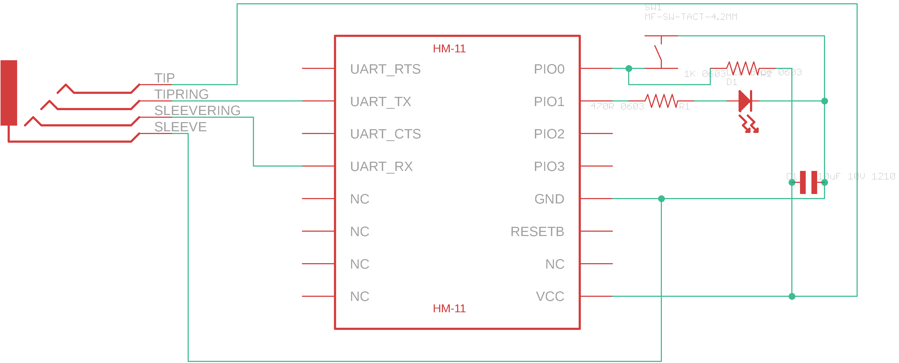
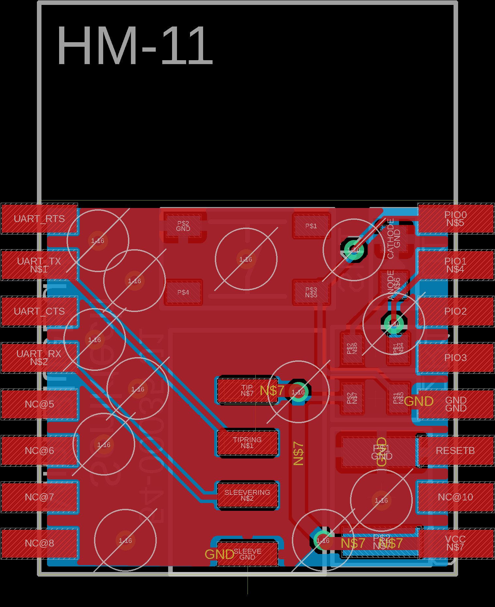

# bluetooth-buddy
Easily get debug info from your projects using a smartphone

Bluetooth Buddy was an idea I had to easily add a standard serial port using a simple headphone jack that I would connect a dongle to that would broadcast serial messages that it received over Bluetooth.

This is that dongle. Completely untested.

